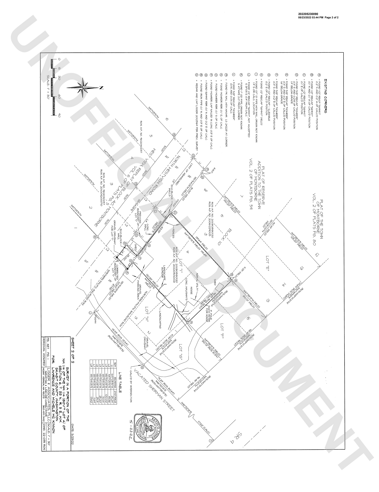

# A table with no prose in it

Page 2 of the same survey: the EXISTING CORNERS table, where each found monument
is listed with its offset from calculated position — "FOUND 1/2" REBAR 'SHMT'
0.2' N AND 0.2' M OF CALC'D POSITION".

This page is here because it is the opposite of prose. There is no sentence
structure to fall back on, so a reader that paraphrases produces something that
reads correctly and says different numbers, and a reader that summarises
produces a description of a table instead of the table.

It has its own history: these 2,072 characters reached OCR, reached the
transcription sidecar, and produced no fragment at all, because the segmenter
dropped them and the failure looked like a clean, complete document. Coverage,
not just accuracy, is the thing this page measures.

## Prompt

Transcribe all text visible in this document page image exactly as it appears, preserving reading order and line breaks. Output ONLY the transcription.

## Checks

- response_contains: EXISTING CORNERS
- response_contains: REBAR
- response_contains: CALC
- response_contains: 202205230090
