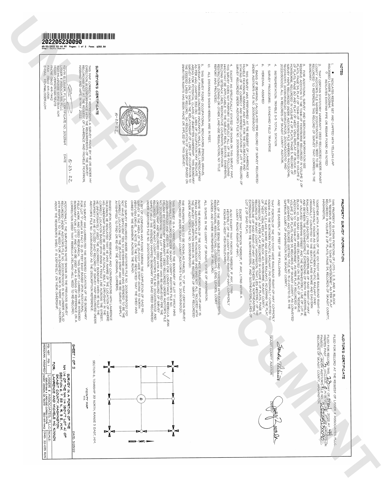

# A recorded survey, at the resolution its lettering needs

The page every OCR decision in raglit has been justified by: a record of survey
whose notes and certificate run at about 3.6pt — 10 pixels of glyph height at
200 DPI, against 18-25 for an ordinary page.

The checks are not a similarity score. They are five facts a person established
by re-reading the sheet at 150% and recording the result as a corrected page
reading, so a failure names the thing that is wrong rather than reporting that a
number moved.

The `response_not_contains` entries are misreadings that have actually been
produced on this page by a model in this fleet: `2008081020` for the deed's
auditor file number is the one a person had to correct by hand, and `201364` is
what a 27B vision model returned for the certificate at 200 DPI while sounding
entirely certain. A configuration that reintroduces either has regressed to a
known-bad state, which a drifting score would not have said.

The surveyor's name was checked as `HALVOR` until 2026-08-03, which no
configuration could ever pass: the sheet says `LISSER`, and the pseudonym had
been applied to the prose in this repository but not to the fixture the prose
describes. Every run since the probe was written reported that check as a model
failure. It is the name that reveals a reader NORMALISING rather than
transcribing — `LISER`, `LISSEY` and `L1SSER` have all been produced here — so it
is worth checking, correctly.

The fixture is rendered at 400 DPI deliberately. At 200 the pixels are not there
to read, and this probe would then measure the renderer rather than the model —
raglit chooses render resolution per page for the same reason (`renderDPIFor`).
Note that the fleet must also allow the tokens: at the default `--image-max-tokens`
a letter page is already at the ceiling and everything above ~3.7 MP is resized
away before the model sees it.

## Prompt

Transcribe all text visible in this document page image exactly as it appears, preserving reading order and line breaks. Output ONLY the transcription.

## Checks

- response_contains: 20123169
- response_contains: 202107080106
- response_contains: 200808180120
- response_contains: 202205230090
- response_contains: LISSER
- response_not_contains: 2008081020
- response_not_contains: 201364
